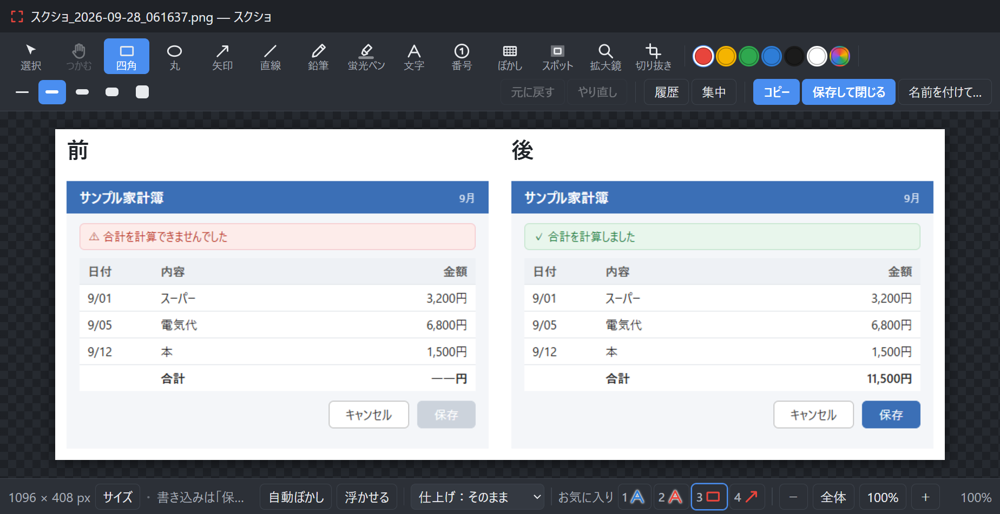

# ScreenShooter

範囲を選んで画面を撮り、そのまま赤枠・矢印・文字・ぼかしを書き込んで、コピーか保存をする Windows 用のツール。
ScreenPresso の置き換えとして作ったもの。自分のパソコンだけでなく、社内でチームで使うことも前提にしている。タスクトレイ（画面右下）に常駐し、**Ctrl+Shift+S** で呼び出す。



**使い方はすべて [手順書（docs/manual.md）](docs/manual.md) にある。**

## できること

- 範囲・窓・画面全体を撮る。窓に枠が吸い付くのでクリックだけで撮れる／前回と同じ範囲をもう一度
- 四角・丸・矢印・文字・番号・蛍光ペン・ぼかし・スポットライト・拡大鏡。**あとから何日たっても動かせる**
- 長いページをスクロールしながら1枚に／録画して MP4 と GIF に
- 直す前と後を並べて1枚に・違いに自動で赤枠
- 写ったメールアドレス・電話番号・API キーなどを自動でぼかす（文字の読み取りはパソコンの中だけ）
- 撮った絵を画面に浮かせて見ながら作業／サイズ変更・余白・影つきや角丸などの仕上げ
- 撮った直後にクリップボードへ（自動ぼかしのあと）／編集画面を開かずに履歴パネルへ並べることもできる
- 画面の文字を読み取ってコピー（読み取りはパソコンの中だけ。設定でオンにすれば Claude で翻訳も）／画面の色を拾ってコピー
- 画面が直ったら、書き込みはそのままに下の絵だけ差し替え／書き込み版を渡すと、相手の ScreenShooter で図形を動かせる
- 録画の一時停止・録る前のカウントダウン・録画中の自動ぼかし

## 入れ方（新しいパソコン）

Windows 10/11 と [Node.js](https://nodejs.org/)（LTS 版）が要る。PowerShell で次を順に実行する。

1. コードを取ってくる（GitHub の「Code → Download ZIP」で落として展開してもよい）

   ```powershell
   git clone https://github.com/GryutHub2/ScreenShooter.git
   ```

2. そのフォルダで部品を入れる

   ```powershell
   npm install
   ```

   `node_modules\electron\dist` が空のままなら `node node_modules\electron\install.js` を実行する

3. 起動用のショートカットを作る（デスクトップとスタートメニューにできる）

   ```powershell
   powershell -ExecutionPolicy Bypass -File tools\make-shortcut.ps1
   ```

exe は作らない。ショートカットが `node_modules\electron\dist\electron.exe` にこのフォルダを渡して起動する
（無署名の exe は Windows の Smart App Control に止められるため）。

## 起動

デスクトップの **ScreenShooter** をダブルクリックする。タスクトレイに赤いアイコンが出れば動いている。

Windows の起動時に自動で常駐させたいときは、トレイのアイコンを右クリック →「設定…」→「起動」の
**「Windows の起動時に自動で起動する」**にチェックを入れて「保存する」を押す。
スタートアップ フォルダ（`shell:startup`）に `ScreenShooter.lnk` ができる。チェックを外すと、このアプリを起動するショートカットだけが消える。

撮影だけでコピーしたいときは、設定の「撮った直後」で **「編集画面を開かずに自動コピーする」** をオンにして保存する。
自動ぼかしのあとに絵がクリップボードへ入り、画面中央の下寄りに「クリップボードにいれました」が1秒だけ出る。
編集画面と履歴パネルは自動では開かない。オフにすると「開くもの」「クリップボード」の設定に従う。

## 翻訳（Claude）を使うとき

設定の「AI（Claude）」をオンにすると、読み取った文字の窓に「Claude で翻訳」が出る。押したときだけ、文字（絵ではない）を Anthropic へ送る。
このパソコンの Claude（Claude Code）にログインしている必要がある。「ログインが必要です」と出たら、PowerShell で1回だけ次を実行してブラウザで承認する。

```powershell
& (Get-ChildItem "$env:LOCALAPPDATA\Packages\Claude_*\LocalCache\Roaming\Claude\claude-code\*\claude.exe", "$env:LOCALAPPDATA\Packages\Claude_*\LocalCache\Roaming\Claude\claude-code\*\*\claude.exe" | Sort-Object LastWriteTime | Select-Object -Last 1).FullName auth login
```

Claude Code を別に入れたパソコン（`claude.exe` が PATH にある）では、`claude auth login` でよい。

## どのファイルを直すと何が変わるか

| ファイル | 担当 |
|---|---|
| `main.js` | 常駐・トレイ・ホットキー・画面の取り込み・保存・履歴の出し入れ |
| `lib/store.js` | 履歴フォルダの読み書きと削除 |
| `lib/snap.js` | ウィンドウ位置（物理ピクセル）→ オーバーレイ（CSS ピクセル）の換算 |
| `lib/stitch.js` | スクロール撮影のつなぎ合わせ（重なりの検出と連結） |
| `lib/gif.js` | GIF の組み立て（減色・圧縮・差分のコマ） |
| `lib/diff.js` | 2枚の違いを探して、枠にする四角を決める |
| `lib/pii.js` | 読み取った文字から、個人情報・APIキーらしい所の四角を決める（自動ぼかし） |
| `lib/ocrtext.js` | 読み取った文字を、コピーできる文章に並べ直す |
| `lib/pngmeta.js` | 書き込み版の PNG に、元の絵と図形を入れる・読む（チームで渡すとき） |
| `lib/claude.js` | このパソコンの Claude を呼んで翻訳する |
| `renderer/editor.*` | 編集画面（道具・描画・元に戻す・書き出し・サイズ変更） |
| `renderer/resample.js` | 絵の大きさを変える計算（Lanczos） |
| `renderer/overlay.*` | 範囲選択の画面（暗幕・拡大鏡・サイズ表示） |
| `renderer/library.*` | 履歴パネル |
| `renderer/pin.*` | 画面に浮かせた絵の窓 |
| `renderer/record.*` | 録画の操作バーと、止めたあとの確認画面 |
| `renderer/progress.*` | 実行中に隅に出る小さい窓 |
| `renderer/ocr.*` | 読み取った文字を直してコピーする窓 |
| `renderer/countdown.*` | 時間差・録画の前に画面の真ん中に出す大きなカウントダウン |
| `renderer/settings.*` | 設定画面 |
| `preload.js` | 画面と本体のあいだで許可する用件の一覧 |
| `tools/win-rects.ps1` | Windows にウィンドウ位置を聞く／マウスホイールを送る |
| `tools/ocr.ps1` | Windows の文字読み取りで、絵に写っている文字と位置を読む |
| `tools/cursor.ps1` | いまのマウスカーソルの絵と、指している点を Windows に聞く |
| `tools/make-icons.js` | アイコンの生成（`npm run icons`） |
| `tools/make-shortcut.ps1` | 起動用ショートカットの作成 |

直したら、**トレイの「終了」でいったん終わらせてから起動し直す**（起動中のプロセスには反映されない）。
直すときの注意点は [AGENTS.md](AGENTS.md) にまとめてある。

## 変更履歴

### V32（2026-10-03）

- 文字を読み取ってコピー（直してからコピー。設定でオンにすれば Claude で翻訳）・色を拾ってコピー。どちらもトレイとキーから
- マウスカーソルも写す（動かせる・消せる図形として置く。範囲選択で M キー）
- 編集画面：中かっこ（K）・文字の書体／太字／斜体／下線／寄せ（「書式」ボタン）・「撮り直し・差し替え」で書き込みはそのままに下の絵だけ差し替え
- 履歴パネル：名前を変える（F2）・タイトルとタグ（付けてあるタグから選べる札の形）・絞り込み（Ctrl+F）・ファイルの場所をコピー・右クリックメニューの文字を大きく
- 録画：一時停止・録る前のカウントダウン・録画中の自動ぼかし
- 書き込み版に元の絵と図形を入れ、ScreenShooter に落とすと図形を動かせる（チームで渡す用）

### V31（2026-10-03）

- 撮った直後：クリップボードへ自動で入れる（絵／絵とファイルの場所／場所だけ。自動ぼかしのあと）・編集画面を開かずに履歴パネルへ並べる、を設定で選べる
- 編集画面：四角の角丸・破線／点線・拡大鏡の倍率の欄、Ctrl＋＋／− で文字の大きさ・線の太さ、「サイズ」から余白を足す、仕上げに「角を丸める」
- 範囲選択中に矢印キーで1pxずつ調整／時間差撮影は秒数を設定でき、画面の真ん中に大きくカウントダウン（専用キーも）
- 履歴パネル：Ctrl+V でクリップボードの画像を足す・並び順（古い順／新しい順／名前順）。トレイに「クリップボードの画像を開く」
- 設定に「Windows の起動時に自動で起動する」

<details>
<summary>それより前（V1〜V30）</summary>

- **V30** — 編集画面に吹き出し（U）と省略（X：横の帯を抜いてギザギザでつなぐ）
- **V29** — 名前を「スクショ」から ScreenShooter に変更し、設定・履歴・保存先を旧名から引っ越す
- **V28** — Ctrl+S（保存して閉じる）でクリップボードにも最終の絵を入れる
- **V27** — 編集画面のサイズ変更（Lanczos）・自動ぼかしの見出しを追加し設定でも足せる・連番マーカーを少し小さく
- **V26** — 編集画面のタイトルバーを自作して文字を大きく・Shift で図形の位置に吸い付き・浮かせた絵の縁ドラッグで大きさ変更
- **V25** — 仕上げに黒い縁取り・自動ぼかしの強さと正規表現の登録語
- **V24** — 前回と同じ範囲・丸／蛍光ペン／スポット／拡大鏡・お気に入り・仕上げ・並べて1枚に・違いに赤枠・浮かせる・個人情報の自動ぼかし
- **V23** — 枠の中に文字を書ける（枠の幅で自動改行）。履歴パネルの最新が右下に
- **V22** — 「つかむ」道具（キー H）
- **V21** — 履歴パネルで選んで Ctrl+C でコピー
- **V20** — 履歴パネルで複数まとめて選べる
- **V19** — 窓が真っ白なまま残るとき、自分で読み込み直す。自動起動の設定をアプリから外した
- **V18** — 集中モード（キー F）。撮ったもの以外の画像も開ける
- **V17** — 履歴パネルから他のアプリへドラッグ
- **V16** — 撮った瞬間に保存先へ保存。書き込みは `_書き込み.png` として別に書き出す
- **V15** — 履歴パネルの下にボタン列
- **V14** — Ctrl+S で保存して閉じる。文字の大きさ16段階・文字の飾り・画像の外に置いた文字が切れない
- **V13** — 録画の確認画面が1回だけ手前に出る
- **V12** — 録画にパソコンの音
- **V11** — GIF のちらつきを解消・網掛け（ディザ）
- **V10** — GIF の減色の修正。横幅を既定で縮めない
- **V9** — 録画（MP4・GIF）
- **V8** — 分割保存
- **V7** — 履歴パネルが2秒で引っ込む。スクロール撮影の失敗時に比べた2枚を残す
- **V6** — スクロール撮影の歩幅を実測で決める。サムネイルの大きさを設定で
- **V5** — スクロールキャプチャと時間差撮影
- **V4** — 連番マーカー ①②③
- **V3** — ウィンドウに吸い付く範囲選択
- **V2** — 撮影履歴（あとから図形を動かせる）
- **V1** — 最初の版。範囲・画面全体の撮影、書き込み、元に戻す、保存、コピー、トレイ常駐

</details>
