# ScreenShooter 手順書

> 画像に写っている家計簿・メモは説明用の架空の画面です。
> 動く画像の赤い吹き出しとクリックの波紋は説明のために足したもので、実際のアプリには出ません。
> **▶ で始まる行はクリックすると開きます**（細かい決まりを畳んであります。ふだんは読まなくて大丈夫です）。

## 目次

**基本の使い方**

| 知りたいこと | 節 |
|---|---|
| 撮り方・ショートカットキー | [撮る](#撮る) |
| 道具とキー（四角・矢印・文字・ぼかし…） | [書き込む](#書き込む) |
| どこに保存されるか・コピーの仕方 | [保存とコピー](#保存とコピー) |
| 前に撮ったものを開き直す | [あとから直す履歴パネル](#あとから直す履歴パネル) |

**やりたいこと別**

| やりたいこと | 使う機能 |
|---|---|
| [直す前と直した後を、1枚で見せる](#直す前と直した後を1枚で見せる) | 同じ範囲・並べて1枚に・違いに赤枠 |
| [図形をきれいに並べる](#図形をきれいに並べる) | 図形のコピー・Shift で吸い付く |
| [見本の絵を浮かせて、見ながら作業する](#見本の絵を浮かせて見ながら作業する) | 浮かせる・大きさ・濃さ |
| [個人情報が写った画面を人に渡す](#個人情報が写った画面を人に渡す) | 自動ぼかし・ぼかし |
| [「ここを見て」と目立たせる](#ここを見てと目立たせる) | スポットライト・拡大鏡・蛍光ペン・吹き出し・お気に入り |
| [長いページを1枚にする](#長いページを1枚にする) | 長いページ・分割保存・省略 |
| [操作の様子を動画で見せる](#操作の様子を動画で見せる) | 録画（GIF・動画） |
| [手順に番号を付けて説明する](#手順に番号を付けて説明する) | 番号マーカー（①②③） |
| [資料に貼る前に、大きさと見た目を整える](#資料に貼る前に大きさと見た目を整える) | サイズ・余白・仕上げ |
| [貼ったときの見え方を確かめる](#貼ったときの見え方を確かめる) | 集中モード |
| [画面の文字・色を取り出す](#画面の文字色を取り出す) | 文字の読み取り・翻訳（Claude）・色を拾う |
| [画面が直ったら、書き込みはそのままに絵を差し替える](#画面が直ったら書き込みはそのままに絵を差し替える) | 撮り直し・差し替え |
| [チームで書き込みを渡し合う](#チームで書き込みを渡し合う) | 書き込み版を渡す・名前・タイトル・タグ・絞り込み |

**そのほか**：[時間差で撮る](#時間差で撮る)／[ほかの画像を開く](#ほかの画像を開く)／[設定](#設定)

---

## 撮る

| 操作 | 動作 |
|---|---|
| **Ctrl+Shift+S** | 範囲を選んで撮る（キーは設定で変えられます） |
| トレイのアイコンを**右クリック** | 範囲を選んで撮る／前回と同じ範囲で撮る／画面全体を撮る／録画する など |
| トレイのアイコンを**左クリック** | 履歴パネルを開く（出ているときにもう一度押すと閉じる） |

範囲を選ぶ画面では：

- マウスを乗せた窓に**青い枠が吸い付く**ので、**クリックだけ**できれいに撮れます
- **ドラッグ**して離すと、その範囲を撮って編集画面が開きます
- **Space** でその画面をまるごと、**Esc** か**右クリック**でやめる
- **M** キーで、その1枚だけ**マウスカーソルも写す・写さない**を切り替えます（既定は設定の「マウスカーソルも写す」）。写したカーソルは、編集画面で動かす・消すができる図形として置かれます
- **矢印キー**で1pxずつ（Shift を押しながらで10pxずつ）合わせられます。押す前は十字の位置（始点）、ドラッグ中は終点が動きます。マウスを動かすと、カーソルの位置に戻ります
- カーソルの横に拡大鏡が出ます（数字は撮ったときの実際のピクセル数）

窓への吸い付きの詳しい決まり

| 操作 | 動作 |
|---|---|
| マウスを動かす | その下のウィンドウ（や、その中の部品）に枠が吸い付く |
| **クリック**（動かさずに離す） | 青い枠の範囲を撮る |
| **マウスホイール** | 部品 → もっと大きい部品 → ウィンドウ全体、と範囲を広げる／狭める |
| ドラッグ | 吸い付きを無視して自由に選ぶ |

- Windows に聞いているのは**位置と大きさだけ**で、タイトルや中身は読みません
- ウィンドウ**全体**はどのアプリでも取れます。「メニューバーだけ」のような**中の部品**は、昔ながらの作りのアプリ（PowerShell・エクスプローラー・メモ帳など）なら取れますが、Chrome・VSCode などは中身を1枚の絵として描いているので取れません
- **このアプリ自身の窓（編集画面・履歴パネル・浮かせた絵）には吸い付きません**（撮影用の暗幕を掴まないため）。ドラッグでなら選べます
- 切りたいときは、設定の「カーソルの下のウィンドウに枠を吸い付かせる」を外します

---

## 書き込む

撮ると編集画面が開きます。上のバーから道具を選び、絵の上をドラッグします。**描いたものはあとから動かせます**（絵に焼き付けていないため）。

| 道具 | キー | 内容 |
|---|---|---|
| 選択 | V | 描いたものを動かす・大きさを変える |
| つかむ | H | 拡大してはみ出した絵を、ドラッグで動かして見る |
| 四角・丸 | R・E | 赤枠・丸い枠 |
| 矢印・直線 | A・L | 矢じり付きの線・ただの線 |
| 鉛筆 | P | なぞったとおりに描く |
| 蛍光ペン | M | 文字の上をなぞって目立たせる |
| 番号 | N | ①②③ を置く |
| 文字 | T | ドラッグで枠を取ると、その幅で折り返す。クリックだけなら枠なし |
| 吹き出し | U | 文字をしっぽ付きの枠に入れる。しっぽの先の四角をドラッグして、指す場所を決める |
| かっこ | K | 「この範囲」を示す中かっこ ｛。範囲の側から説明の側へ引くと、とがった所が説明の側に来る |
| ぼかし | B | 隠したい所をモザイクに |
| スポットライト | S | 囲んだ所以外を暗くする |
| 拡大鏡 | Z | 囲んだ所を丸い窓で拡大 |
| 切り抜き | C | 囲んだ所だけ残す |
| 省略 | X | 要らない横の帯を上下にドラッグすると、そこを抜いて上下をギザギザでつなぐ |

| よく使うキー | 動作 |
|---|---|
| **Ctrl+C** | 絵をコピー（図形を選んでいるときは、その図形のコピー） |
| **Ctrl+S** | 保存して閉じる（閉じたあとそのまま貼れるよう、クリップボードにも入る） |
| Ctrl+Z / Ctrl+Y | 元に戻す / やり直し |
| Delete ／ 右クリック | 選んでいるもの ／ カーソルの下のものを消す |
| 置いた文字を**ダブルクリック** | 文字を直す |

- **置いたものは、どの道具を持っていてもクリック1回で掴めます。**「選択」に持ち替えなくて大丈夫です
- 色と太さは、選んでいる図形にもその場で反映されます。最後に使った色・太さは次に撮ったときも引き継がれます
- 太さの欄の右に、道具に合わせて選ぶ欄が出ます：**線の種類**（実線・破線・点線。四角・丸・直線・矢印）／**角の丸み**（四角）／**倍率**（拡大鏡。1.5〜4倍）
- 文字・吹き出しを持っている（選んでいる）ときは **「書式」** ボタンが出ます。書体（ゴシック・メイリオ・UD ゴシック・明朝・Arial）・**太字**・*斜体*・下線・左／中央／右寄せを選べます
- **Ctrl＋＋ / Ctrl＋−** で、文字・吹き出し・番号は文字の大きさ、そのほかは線の太さが1段ずつ変わります（文字を入力中でも効きます）

道具ごとの詳しい動き

- **つかむ**：拡大してスクロールバーが出ると自動でこれに切り替わり、「全体」などで収まると元の道具に戻ります。はみ出していないときは押せません
- **四角・丸**：枠線の近くをクリックすると掴めます（内側は空いている扱いなので、中に別のものを描けます）。丸は Shift を押しながらで正円
- **蛍光ペン**：半透明の太い線。**Shift を押しながらで真横にまっすぐ**。矢印や文字より必ず下に描かれます。明るい地では下の文字がくっきり残る塗り方、暗い地ではふつうの半透明（描いた時点で下の明るさを見て決まります）。持っているあいだは、置いた蛍光ペンの上からでも続けて引けます
- **番号**：クリックで置くだけ。ドラッグすると大きさを決められます
- **文字**：枠のある文字は、入力中はあふれた行を矢印キー・ホイールで見られます。確定は Ctrl+Enter か外をクリック。選ぶとハンドルで幅を変えられます
- **吹き出し**：置き方は文字と同じ（ドラッグで枠を取る／クリックだけなら文字に合わせた大きさ）。置くとしっぽが下（下に場所が無ければ上）に出ます。選ぶと、しっぽの先と枠の角に四角が出ます。色の欄で縁の色が変わり、中の字は黒。**白を選ぶと暗い地に白い字**になります。大きさは文字の大きさの欄で変えます（縁の太さも一緒に変わります）
- **ぼかし**：太さでモザイクの粗さが変わります
- **スポットライト**：何か所でも置け、重なっても二重には暗くなりません。枠線は描かれないので、選んでいるとき・持っているときだけ点線で範囲が見えます。明るい所と暗い所の境目の近くをクリックすると掴めます
- **拡大鏡**：約2倍の丸いのぞき窓が横に出て、元の枠と線でつながります。丸はドラッグで動かせ、右下の四角で大きさ（＝倍率）が変わります。丸の上を押すと丸だけ、元の枠線の近くを押すと枠だけが動きます（矢印キーと貼り付けでは両方）。ぼかした所はのぞき窓の中でもぼけたまま
- **切り抜き**：置いたものの上からでもそのまま範囲を取れます。**範囲の外に丸ごと出た書き込みは消えます**（Ctrl+Z で戻せます）
- **省略**：上下にドラッグした横の帯（赤く塗られる所）が抜け、上下が白い隙間とギザギザの切れ目でつながります。帯の中に丸ごと入っていた書き込みは消え、帯より下の書き込みは一緒に上へ詰まります（帯をまたぐ枠は縮みます）。何本でも抜け、つなぎ目の上からもう一度選ぶと前の帯とまとまります。保存先の元の絵は削られないので、Ctrl+Z でいつでも戻せ、あとから履歴で開き直しても抜いたままです

重なる順は下から「絵 → ぼかし → スポットライトの暗さ → 拡大鏡 → 蛍光ペン → 矢印・文字など」。蛍光ペンと重なっているときは、上に見えているほうが先に掴まれます。すでに置いたものの上に重ねて描きたいときは、少しずらして描いてから動かします。

キー操作の一覧

| キー | 動作 |
|---|---|
| Ctrl+V | コピーした図形を貼り付ける。少しずらして置かれ、続けて押すとさらにずれる |
| Ctrl+S | 書き込み（または仕上げ・サイズ変更）があれば `_書き込み.png` を書き出して閉じる。無ければ保存済みなので閉じるだけ |
| Ctrl+Alt+S | 名前を付けて保存。書き込みも仕上げも無いときは**元のファイルの名前が変わる**（増えない） |
| 矢印キー | 選んでいるものを 1px 動かす（Shift で 10px） |
| Shift を押しながら描く | 正方形・正円・水平垂直・45度にそろえる。蛍光ペンは真横 |
| Shift を押しながら動かす | ほかの図形（と絵）の中心・端、同じ間隔になる位置へ吸い付く（ピンクの線が出る） |
| Ctrl+マウスホイール | 拡大・縮小 |
| Ctrl＋＋ / Ctrl＋− | 文字の大きさ（文字・吹き出し・番号）／線の太さ（そのほか）を1段ずつ |
| 1〜4 | 書き方のお気に入りに持ち替える（文字の入力中は効かない） |
| F | 集中モードの切り替え |
| Esc | 選択を解除 → 集中モードを解除 → ウィンドウを閉じる、の順 |

太さ・色・文字の大きさと飾り

- 太さは 2 / 4 / 7 / 12 / 20px の5段階。蛍光ペンだけは文字の高さに届くよう 12 / 18 / 24 / 32 / 44px
- 蛍光ペンの色は別に覚えていて、最初は黄色。蛍光ペンを持つか選んでいるときに色を選ぶと、蛍光ペンの色だけが変わります
- 文字・番号を持っている（選んでいる）ときは、太さの欄が文字の大きさの欄に入れ替わります
- **文字の大きさ**：9〜96px の16段階。番号の丸の大きさもこれで決まります
- **フチの太さ**：細い / ふつう / 太い / 極太 / ベタ塗り。「ベタ塗り」は白い板に載せたような見た目。文字の大きさに合わせて太くなります

| 飾り | どうなるか |
|---|---|
| **おまかせ**（既定） | 明るい色の文字なら黒フチ、暗い色なら白フチを自動で付ける |
| 白フチ / 黒フチ | フチの色を自分で決める |
| 影 | フチは付けず、右下に影を落とす |
| 白フチ＋影 | 写真や複雑な画面の上でいちばん読みやすい |
| 飾りなし | 文字だけ |

絵の外に文字を置いたとき（画角が広がる）

**絵の外に文字などを置いても切れません。** はみ出したぶんは自動で画角に足され、そのまま保存・コピーすれば全部入ります。

- 増えた部分は**透明**です（編集画面ではチェック柄。PNG で保存すれば透けたまま）。切り抜いたあとに広がっても、捨てた絵は出てきません
- 左下のサイズ表示が `741 × 382 px（はみ出したぶんを足しています）` に変わります。この数字が実際に保存される大きさです
- 文字を絵の中に戻せば、画角も元に戻ります。描いている最中は動かず、離したときに広がります
- 拡大鏡の丸は、自動で置くときは絵の中に収まる所を選びます（狭いときは丸を7割まで縮めて収める）

---

## 保存とコピー

**撮った瞬間に、保存先フォルダ（既定は `ピクチャ\ScreenShooter`）へファイルが出ます。** 保存し忘れはありません。Esc で閉じても残ります。

- ファイル名は `ScreenShooter_2026-09-09_231530.png` の形（撮った時刻）
- **撮った絵は、自動ぼかしが済んだらクリップボードにも入ります**（撮ってから1〜3秒）。そのまま貼れます。入れるもの（絵／絵とファイルの場所／場所だけ／入れない）は設定の「撮った直後」で変えられます
- 書き込んで **Ctrl+S** を押すと、元の絵とは別に `_書き込み.png` が出ます。元の絵を残すので、あとからでも矢印を動かせます
- 保存先は設定で変えられます。トレイの右クリック →「保存フォルダを開く」ですぐ開けます

何をするとファイルがいくつできるか

| したこと | 出るファイル |
|---|---|
| 撮って Esc で閉じる | 1個（`ScreenShooter_日付_時刻.png`） |
| 書き込んだが保存を押さない | 1個のまま。書き込みは履歴が覚えているので、次に開けば続きから直せる |
| 書き込んで（または仕上げ・サイズ変更をして）「保存して閉じる」 | 2個（元の絵＋`_書き込み.png`） |
| 「名前を付けて…」（書き込みも仕上げも無し） | 1個のまま。**コピーではなく名前が変わるだけ** |
| 「名前を付けて…」（書き込みか仕上げあり） | 元の絵＋その名前のファイル |

- 同じ秒に2枚撮った・同じ名前があったときは、後ろに `-2` が付きます（上書きしません）
- 録画も止めた瞬間に、同じ名前で `.mp4` と `.gif` の両方が出ます
- 原寸の絵はこのフォルダの1個だけです。履歴が持っているのはサムネイルと書き込みの位置だけなので、**同じ絵が2か所にできません**

---

## あとから直す（履歴パネル）

トレイのアイコンを**左クリック**すると、右下に撮ったものの一覧が出ます。

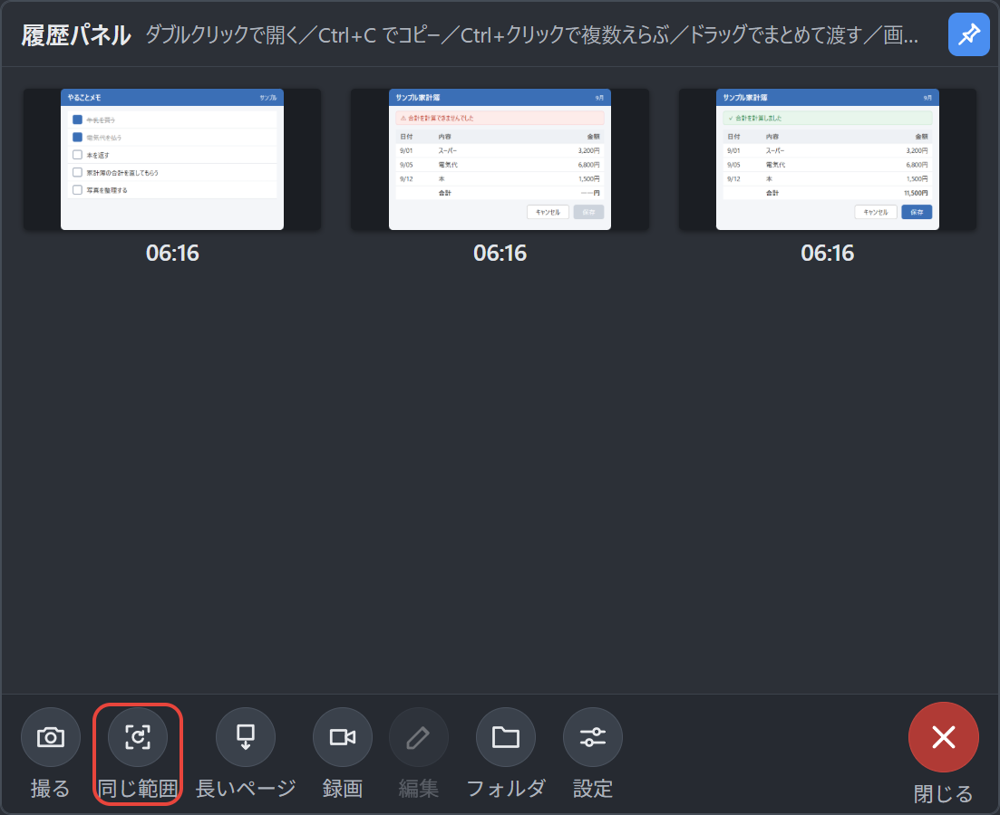

| 操作 | 動作 |
|---|---|
| **ダブルクリック** | 編集画面で開き直す。前に描いた枠も矢印もそのまま掴める（録画は再生） |
| 選んで **Ctrl+C** | 開かずにコピー（書き込み・切り抜き・仕上げ込みの、編集画面の Ctrl+C と同じ絵） |
| 外へ**ドラッグ** | 保存先にある原寸のファイルを、そのまま他のアプリへ渡す |
| **右クリック** | 編集する／コピー／画面に浮かせる／ファイルの場所を開く／履歴から消す |
| Ctrl+クリック・Shift+クリック・Ctrl+A | 何枚かまとめて選ぶ（エクスプローラーと同じ）。Esc で解除 |
| **Ctrl+V** | クリップボードの画像を、撮ったものと同じように保存先へ入れて一覧に足す（トレイの「クリップボードの画像を開く」なら編集画面で開く） |
| **Ctrl+F** | 上の欄で絞り込む（ファイル名・タイトル・タグ・撮った日。Esc で全部に戻る） |
| **F2** | 名前を変える（保存先のファイルの名前も変わる） |

- マウスが離れて2秒で引っ込みます。ピン留めボタンで出しっぱなしにもできます
- 下のボタン列から、撮る・同じ範囲・長いページ・録画・編集・フォルダ・設定ができます（撮るときはパネルが自動で引っ込みます）
- **「履歴から消す」で消えるのは履歴だけです。** 保存先のファイルは残ります

履歴パネルの細かい決まり

- 開くのはトレイの左クリック・右クリックの「履歴パネルを開く」・編集画面の「履歴」ボタンから。**撮った直後には出ません**（編集画面と二重になるため）
- 開いてから一度もマウスを乗せなかったときは、5秒で引っ込みます。消えかけている間にマウスを戻せば元に戻ります
- 既定では**古いものが左上、いちばん新しいものが右下**に並びます。設定の「並び順」で、新しい順（最新が左上）・ファイル名の順にも変えられます。新しく撮ったときと出したときは、最新が見える所まで自動で送ります
- 設定の「撮った直後」を「開かずに履歴パネルに並べる」にすると、撮るたびに編集画面ではなくこのパネルが出ます（自動ぼかし・クリップボードへのコピーは裏で済みます）
- 既定で3列×3段。端をドラッグすると大きさが変わり、その形を覚えます。サムネイルの大きさは設定で 64〜240px
- ダブルクリックで開いた編集画面が手前に出て、パネルは後ろに回ります
- Ctrl+C は、何枚も選んでいるときと録画ではしません（ドラッグで渡します）
- ドラッグで渡るのは、書き込み済みなら `_書き込み.png`、録画は動画と GIF の両方。**何枚か選んでいれば全部を1回で**渡せます（順番は一覧の並び順）
- 2枚以上選ぶと右上に「◯件えらび中」と出て、右クリックが**まとめて扱う**メニュー（浮かせる／並べて1枚に／違いに赤枠／ファイルの場所／履歴から消す）に変わります
- 「編集」ボタンは1つだけ選んでいるときに押せます（編集画面がいくつも開かないように）
- 書き込みは**押すたびに自動で履歴へ保存**されます。閉じるときに「保存しますか？」とは聞きません
- 履歴は既定で300枚まで。超えたら古いものから履歴だけが消えます（設定で変更可）
- 逆に、**保存先のファイルを自分で消したり動かしたりすると、その履歴は開けなくなります**
- 置き場は `%APPDATA%\ScreenShooter\library`（サムネイルと書き込みの位置だけなので軽い）

---

## 直す前と直した後を、1枚で見せる

Claude などに直してもらったとき、「前はこう → 今はこう」を1枚の絵で伝える手順です。

### 1. 直す前の画面を撮る

**Ctrl+Shift+S** を押して、見せたい所をドラッグで囲みます。

撮った瞬間に保存されるので、開いた編集画面は **Esc** で閉じてかまいません。

### 2. 直ったら「同じ範囲」でもう一度撮る

画面右下のトレイにある赤いアイコンを**左クリック**して履歴パネルを出し、下の **「同じ範囲」** を押します。

- 範囲を選び直さなくても、**1ピクセルもずれずに**同じ所が撮れます
- トレイのアイコンを右クリック →「前回と同じ範囲で撮る」でも同じです

「同じ範囲」の入口と、使えないとき

| 入口 | 動作 |
|---|---|
| トレイの右クリック →「前回と同じ範囲で撮る」 | 前回の範囲をすぐ撮る |
| 設定の「同じ範囲でもう一度」に決めたキー | 同上（**既定はキー無し**。他のアプリとぶつからないキーを自分で決める） |
| 履歴パネルの下の「同じ範囲」 | 同上。パネルは写り込まないよう先に引っ込む |
| 編集画面の「同じ範囲で撮り直す」 | **いま開いている絵と同じ範囲**を撮り、新しい1枚として開く（元の絵と書き込みは残る。範囲で撮った絵にだけ出る） |
| トレイの右クリック →「前回と同じ範囲で録画」 | 前回の範囲ですぐ録画を始める |

- 覚えるのは範囲選択（ドラッグ・窓への吸い付き・Space）と録画で選んだ範囲です。画面全体・スクロール撮影は覚えません
- まだ一度も範囲で撮っていない、またはモニタの抜き差し・拡大率の変更で画面の構成が変わったときは、**当てずっぽうで撮らずに**ふつうの範囲選択になります（トレイの項目名にも「（範囲を選ぶ）」と出ます）

### 3. 履歴パネルで2枚をえらぶ

直す前の絵を**クリック** → 直した後の絵を **Ctrl を押しながらクリック**。

右上に **「2件えらび中」** と出れば OK です。

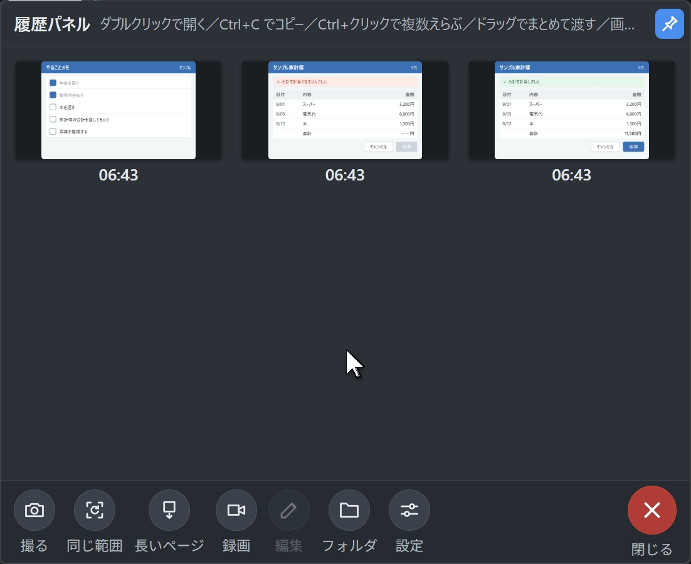

### 4. 右クリックして、見せ方を選ぶ

えらんだ絵の上で**右クリック**すると、メニューが出ます。見せ方は2通りあります。

#### A. 「横に並べて1枚に」 — 前と後を並べる

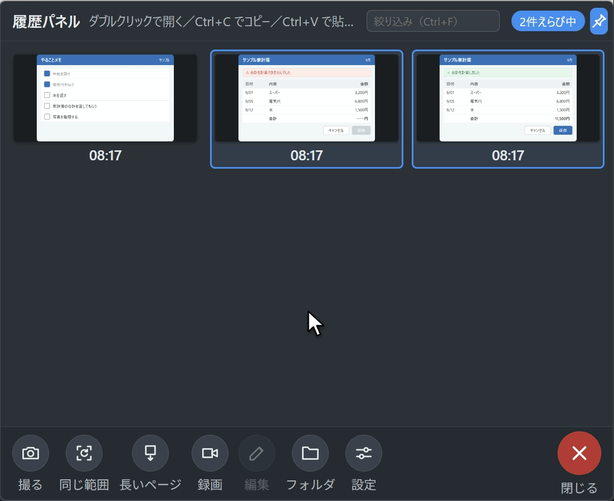

2枚が左右に並んだ1枚ができ、**「前」「後」の見出しが自動で**付きます。できあがりは編集画面で開きます。

- そのまま **Ctrl+C** でコピーして、チャットや資料に貼り付けます
- 見出しはふつうの文字なので、ダブルクリックで書き直せます
- 縦に並べたいときは「縦に並べて1枚に」を選びます

並べて1枚にの細かい決まり

- 並ぶ順は一覧の並び順（古いものが左・上）。3枚以上なら見出しは ①②③…
- 書き込みと切り抜きはそのままの見た目で並びます。大きさの違う絵は縮めずに原寸で並べ、足りない所は白い余白になります（縮めると字がにじむため）
- できた絵は新しい1枚として保存先・履歴に入ります。元の絵はそのままですが、元の絵の矢印をあとで直しても、並べた絵には反映されません
- 録画は並べられません（除いて並べ、その旨が出ます）
- 縦に長くなったら、編集画面の「分割保存」で Google ドキュメントにそのまま貼れます

#### B. 「違いに赤枠を付ける」 — 変わった所に印を付ける

直した後の絵が編集画面で開き、**変わった所に赤い四角が自動で**付きます。

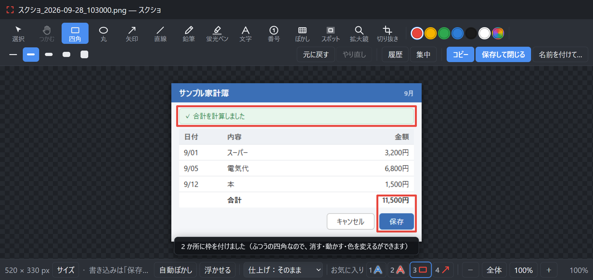

- 赤い四角はふつうの四角です。消す・動かす・色を変える、が自由にできます
- **Ctrl+Z を1回**押すと、付いた枠をまとめて消せます

違いに赤枠の細かい決まり

- 新しいほう（あとで撮ったほう）が開き、古いほうから変わった所に太さ 4px の赤い四角が置かれます。違いが無ければ「違いは見つかりませんでした」と出ます
- 比べるのは**書き込む前の元の絵どうし**です（前に描いた矢印などは数えません）
- 文字のにじみ・小さな色の揺れ・点滅するカーソルは無視します。近い違いは1つにまとめ、30を超えそうならさらに大きくまとめます
- 新しいほうを切り抜いてあれば、その範囲の中だけに付けます

### うまくいかないとき

| こうなった | こうする |
|---|---|
| 「同じ範囲で撮った同じ大きさの2枚を選んでください」と出る | 2枚の大きさが違うか、録画が入っているか、2枚ではありません。手順2の「同じ範囲」で撮り直します |
| 変わっていない所にも枠が付く | ページのスクロール位置がずれています。同じ位置まで戻してから撮り直します |
| 「同じ範囲」を押すと、範囲を選ぶ画面になる | まだ一度も範囲で撮っていないか、モニタの構成・拡大率が変わっています。そのまま範囲を選べば撮れます |

---

## 図形をきれいに並べる

同じ四角をいくつも付けて、縦や横にぴったりそろえる手順です。編集画面で使います。

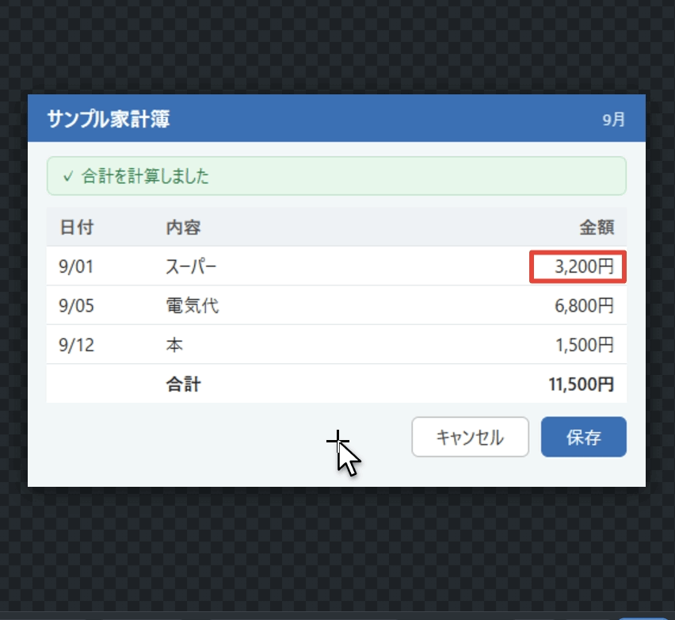

### 1. 図形を選んで、Ctrl+C → Ctrl+V

- 付けた四角を**クリック**して選び、**Ctrl+C** → **Ctrl+V**
- 同じ四角が、少しずれた所にできます。続けて Ctrl+V を押すと、さらにずれた所にもう1つできます

### 2. Shift を押しながらドラッグ

- できた四角を掴んで、**Shift を押しながら**動かします
- ほかの図形の**端・中心**にそろう位置に来ると吸い付き、**ピンクの線**が出ます
- 3つ以上あるときは、**間隔が同じ**になる位置にも吸い付きます

**掴む所に気をつける**
- 四角の角と、辺の真ん中にある小さな四角は、大きさを変えるつまみです
- 動かしたいときは、つまみを避けて**辺の上**を掴みます

| ほかの操作 | 動作 |
|---|---|
| 矢印キー | 選んでいる図形を 1px 動かす（Shift を押しながらで 10px） |
| Shift を押しながら描く | 正方形・正円・まっすぐな線になる |
| Ctrl+Z | 1つ前に戻す |

---

## 見本の絵を浮かせて、見ながら作業する

撮った絵を、いつもいちばん手前に浮かべておく手順です。数字を見ながら別の画面に打ち込むときなどに使います。

### 1. 浮かせる

どちらかで浮かびます。

- 編集画面の下の帯にある **「浮かせる」**
- 履歴パネルで絵を**右クリック** → **「画面に浮かせる」**（何枚か選んでいれば全部）

**ドラッグ**で好きな所へ動かせます。閉じるときは、**ダブルクリック**か **Esc** です。

### 2. 大きさを変える

**ホイールを回す** — 上へ回すと大きく、下へ回すと小さくなります。カーソルのある所を中心に大きさが変わります。

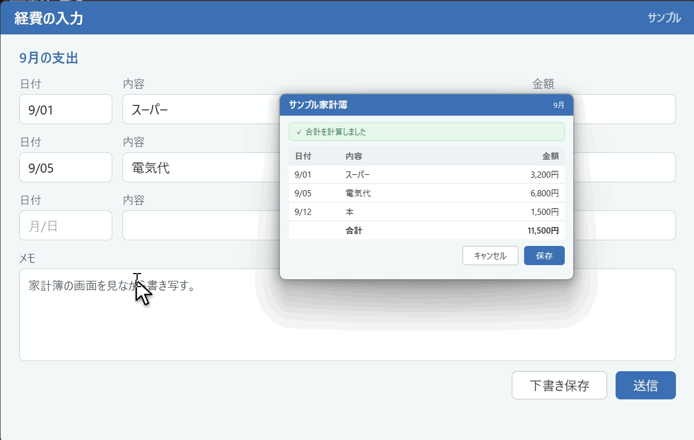

**四隅をドラッグする** — 細かく合わせたいときに使います。縦と横の比は変わりません。

### 3. 透かす

**Ctrl を押しながらホイールを下へ**回すと薄くなり、下の画面が透けて見えます。上へ回すと元の濃さに戻ります。いちばん薄くて 20% までです。

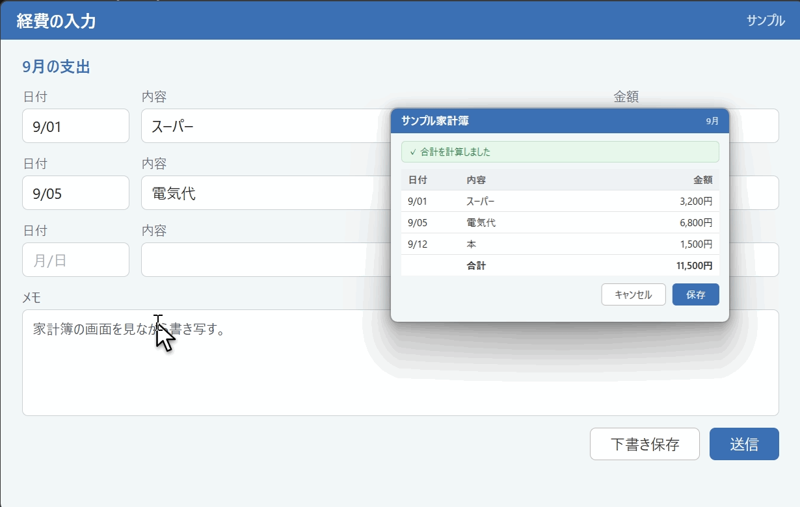

- 浮かせた絵は、撮影や録画にもそのまま写ります
- 浮かせた絵を閉じても、保存したファイルや履歴は消えません

浮かせた絵の細かい決まり

- 右クリックで、閉じる／編集画面で開く／クリップボードにコピー。トレイの右クリック →「浮かせた絵をすべて閉じる」で一度に閉じられます
- 大きさは等倍から始まり、ホイールで4倍まで。範囲で撮った絵は**撮った場所にぴったり重なって**出ます（画面の構成が変わったとき・全画面・スクロール撮影・取り込んだ絵は真ん中寄り）
- 画面に入りきらない大きな絵は、入る大きさまで縮めて出します
- 仕上げ（影つき・背景つき）は付きません。右クリックのコピーも浮かべている絵そのものです
- スクロール撮影のあいだだけは自動で隠れ、終わると元の場所に戻ります（ホイールが吸われるため）
- アプリを終了すると全部閉じます（次に起動しても出てきません）

---

## 個人情報が写った画面を人に渡す

メールアドレスや API キーが写った画面を、ぼかしてから渡す手順です。

### 1. 撮ると、自動でぼける

撮った直後に、写っている文字を読んで、見られて困りそうな所に**自動でぼかしが入ります**。ふつうは1秒ほどです。

- ぼかしが入ったときだけ、赤枠のお知らせが出ます
- 履歴から開いた絵や、あとから書き込んだ絵では、下の帯の **「自動ぼかし」** を押すと読み直します

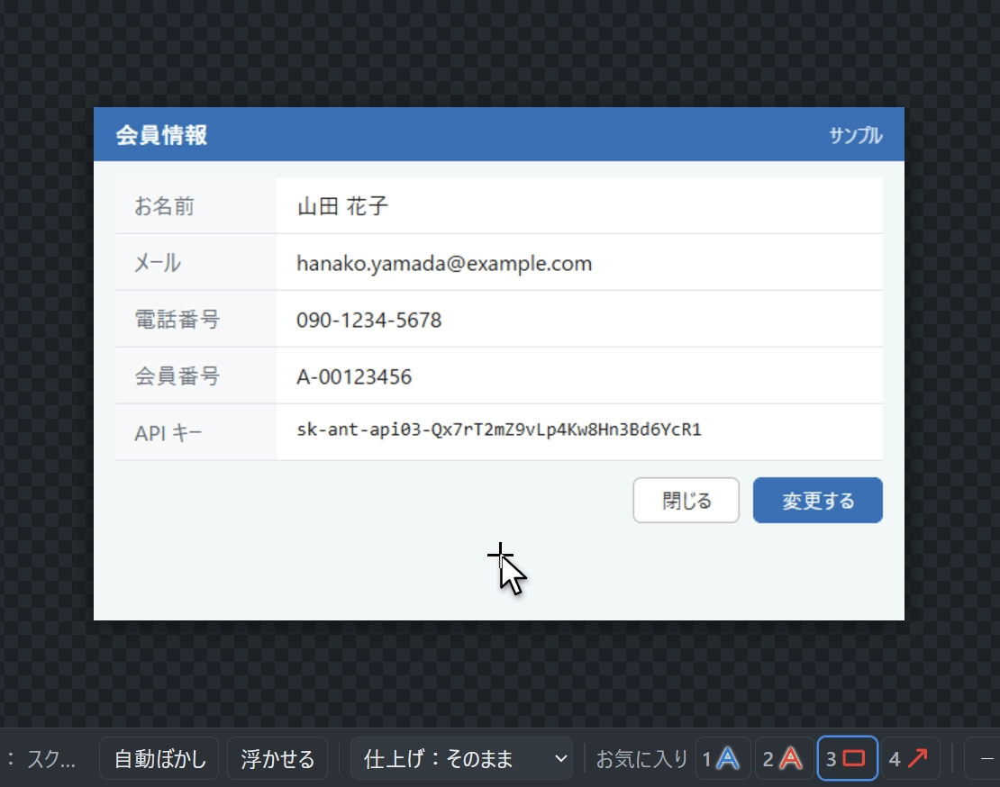

見つけるもの：
- メールアドレス
- 電話番号
- カード番号らしい数字
- API キー
- このパソコンのユーザー名
- 設定の「自動でぼかす言葉」に登録した言葉
- お名前・住所・パスワード・会員番号などの見出しの右（または下）にある値

自動ぼかしの細かい決まり

- API キーは `sk-`・`sk-ant-`・`ghp_`・`github_pat_`・`AKIA`・`xoxb-`・`AIza` で始まるもの、`API_KEY=…` のような値、長いランダムな英数字。ユーザー名は `C:\Users\<名前>` の名前の部分
- 表のように見出しの列と値の列が離れていても、同じ高さの右にあれば値とみなします
- 読んでいる間も書き込めます（「自動ぼかし」ボタンが「確認中…」になります）
- 置かれるのはふつうのぼかしです。動かす・大きさを変える・右クリックで消すができます
- 語のまとまりごとに読むので、`API_KEY=sk-…` は行ごとぼかすなど**少し広めに隠れます**。ターミナルで折り返した長いキーは、次の行の頭もいっしょにぼかします
- 「自動ぼかし」ボタンで読み直すとき、すでにぼかしてある所には重ねません。切り抜いてあればその範囲の中だけ
- 読み終わる前にコピーしていたときは、お知らせに「もう一度コピーしてください」と出ます
- 読み取れなかった・10秒たっても終わらないときは、黙ってやめます（撮影や保存は止まりません）
- やめたいときは設定の「撮影後に個人情報を自動でぼかす」を外します（ボタンは使えます）。録画には効きません

文字の読み取りは、このパソコンの中だけで完結します（根拠）

AI サービスやクラウドの読み取りには、画像を送っていません。

- 使っているのは、Windows に最初から入っている文字読み取りの機能 **「Windows.Media.Ocr」**（Windows OCR）です。Windows 10 から標準で入っています
- Microsoft は公式の開発者ブログで、この機能は「インターネット接続なしで、端末の中だけで動く」と説明しています（原文："runs entirely on the device without requiring an Internet connection"）
- 読み取りに使う辞書は、パソコンに入っている日本語・英語の言語データ（Windows の設定の言語オプションにある「光学式文字認識」）です
- このアプリ自体にも、インターネットへ送る処理は入っていません。撮った絵も読んだ文字も外へ出さず、読んだ文字はどこにも残しません
- **自分で確かめる方法**：Wi-Fi を切る（機内モードにする）→ 撮る。ネットにつながっていなくても、自動ぼかしはそのまま効きます
- **調べるときの検索語**：「Windows.Media.Ocr」「Windows OCR オフライン」
- 根拠の資料：[簡単に利用できる PDF 文字認識 OCR 比較まとめ ～ AI OCR の頭抜けた実力](https://recruit.group.gmo/engineer/jisedai/blog/ai-ocr/)（GMO インターネットグループ 次世代システム研究室、2021年）
  - OCR を「ローカル系（パソコンに入れて使う）」と「クラウド型」に分けて比べた記事です。Windows.Media.Ocr は **ローカル系 OCR** として紹介されています
- その他の参考資料：[Optical Character Recognition (OCR) for Windows 10](https://blogs.windows.com/windowsdeveloper/2016/02/08/optical-character-recognition-ocr-for-windows-10/)（Microsoft の Windows Developer Blog・英語。上の原文の出典）

※ Windows 全体の診断データ（Microsoft へ送る利用状況）を送るかどうかは、Windows の設定で決まります。このアプリの読み取りとは別の話です。

Presidio（個人情報を見つける Python の道具）を入れていない理由

**Presidio（プレシディオ）** は、Microsoft が無料で公開している、文章から個人情報（PII）を見つける道具です。これもパソコンの中だけで動き、人名・地名を文の流れから当てる AI（固有表現抽出）を持っています。組み合わせれば、見出しの無い名前や住所まで拾える見込みがあります。

それでも、**2026年9月時点では導入を見送っています。** 理由は4つです。

- **日本語の名前・住所に弱い**：そのままでは日本語の名前・住所をほとんど見つけられません。日本語用の部品（GiNZA）を足しても、正解率は6割ほどという検証があります（[日本語の個人情報検出はなぜ難しいのか](https://zenn.dev/nexus_api_lab/articles/20260418-japanese-pii-difficulty)）
- **スクショには文の流れが少ない**：画面の文字は、表や項目名の切れ端です。文章向けの AI は、さらに当たりにくくなります
- **いまの仕組みで足りている**：Windows OCR で読んだ文字を、このアプリが日本向けの決まり（電話番号・カード番号・API キーの形、「パスワード」などの見出し、登録した言葉・正規表現）で調べています。Presidio を日本語で使うときにすすめられる構成の大部分を、すでに持っています
- **重く、止まりやすくなる**：Python と数百 MB 以上の部品が増えます。撮ってからぼけるまでが遅くなり、Windows の Smart App Control（知らないプログラムを止める仕組み）に部品が止められることもあります

どちらを使っても、外へは送りません。見送ったのは、手間に見合うほど精度が上がらないためです。

### 2. 足りない所は、自分でぼかす

**自動ぼかしは、見落としが必ずあります。** 貼る前に、自分の目で確かめます。

- 上の例でも、紹介コードはぼけていません（決まった見出しでも、決まった形でもないため）
- 足りない所は、**B キー**（ツールバーの「ぼかし」）に持ち替えて、ドラッグで囲みます

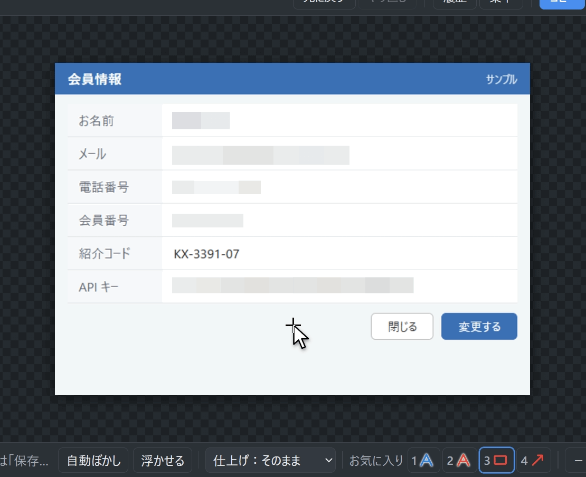

| こうしたい | こうする |
|---|---|
| 余計な所まで、ぼけた | そのぼかしの上で**右クリック**すると消える |
| 自動のぼかしをまとめて取り消す | **Ctrl+Z を1回** |

### 3. いつも出てくる名前・番号は、登録して自動でぼかす

毎回ぼかす名前や番号は、設定に登録しておくと、次から自動でぼけます。上の例の紹介コードも、登録すれば自動ぼかしで消えます。

1. トレイのアイコンを右クリック →「**設定…**」
2. 下の表の欄に、**1行に1つ**ずつ書く（Enter で改行）
3. 「**保存する**」を押す。次に撮った絵から効きます。開いている絵は、下の帯の「自動ぼかし」で読み直します

| 登録するもの | 書く欄 | 例 |
|---|---|---|
| 名前・会社名など、決まった言葉 | 自動でぼかす言葉 | `山田花子` |
| 番号のように「形」が決まっているもの | 自動でぼかす言葉（前後を / で囲む） | `/KX-\d{4}-\d{2}/` |
| 画面の項目名（その右か下の値をぼかす） | 見出しとして探す言葉 | `紹介コード` |

決まった言葉：そのまま書く

- 空白の有無や、全角・半角の違いは気にしなくて大丈夫です。「山田花子」と登録すれば、画面の「山田 花子」（半角の空白）も「山田　花子」（全角の空白）も同じ言葉として探します。英数字の全角・半角（「ＡＢＣ」と「ABC」）も区別しません
- 1行に書いた言葉は、そのひとかたまりで探します。姓だけ・名だけでも隠したいときは、別の行に分けて書きます

形が決まったもの：前後を / で囲む（正規表現）

正規表現は、文字の「形」で探す書き方です。

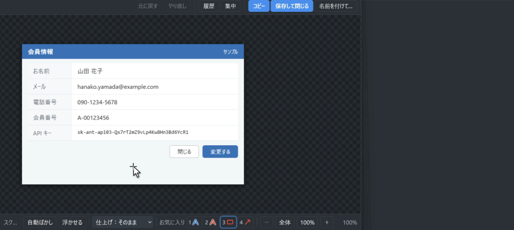

| 書き方 | 当たるもの |
|---|---|
| `/KX-\d{4}-\d{2}/` | KX- と数字4桁、- と数字2桁（紹介コード KX-3391-07 など） |
| `/A-\d{8}/` | A- のあとに数字8桁（A-00123456 など） |
| `/PA\d{9}/` | PA のあとに数字9桁 |

- `\d` は数字1文字、`{4}` は「4回」。`\` は **¥** で打っても同じです
- 桁数は**ちょうど**で数えます（`/A-\d{8}/` は、9桁の A-001234567 には当たりません）
- **/ で囲んだ中には、空白を書きません。** 画面の文字は空白を詰めてから探すので、空白入りの式はどこにも当たりません
- 書き間違えて読めない式は、設定画面に赤字で出ます

項目名：「見出しとして探す言葉」に書く

画面の項目名を書いておくと、**その右（または真下）にある値**をぼかします。値の形がばらばらで、正規表現にしにくいものに向いています。

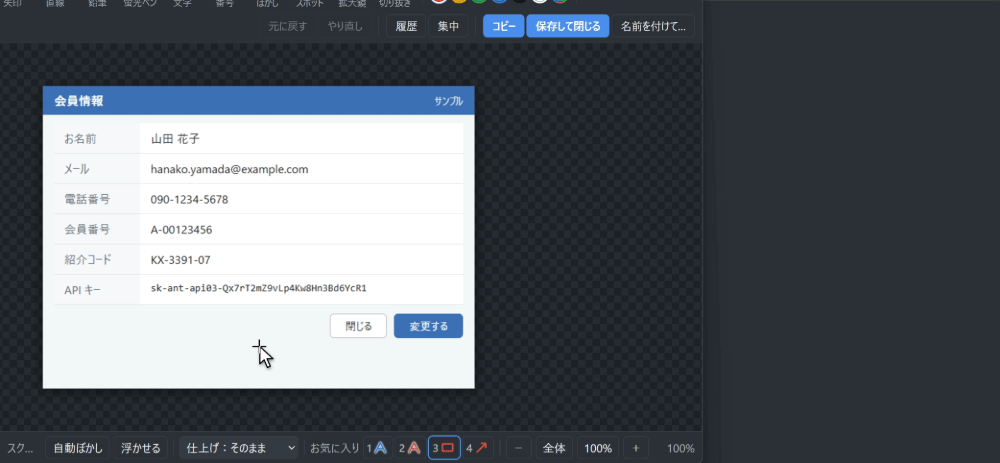

- 最初から探している見出し（書かなくてよいもの）：お名前・氏名・名前・住所・所在地・パスワード・ユーザー名・ユーザーID・ログインID・会員番号・お客様番号・顧客ID・顧客番号・社員番号・従業員番号・契約番号・口座番号・携帯番号・生年月日・マイナンバー・免許証番号・保険証番号・パスポート番号・名義人・有効期限・セキュリティコード・暗証番号（英語の Password・User ID・PIN・CVV なども）
- 最初からの見出しは、ぼかしの強さが「標準」「強」のときに探します。自分で書いた見出しは「弱」でも探します
- 空白・全角半角を気にしなくてよいのは、決まった言葉と同じです
- 「パスワードを忘れた方」のように、文の途中に出てきた見出しは対象外です

---

## 「ここを見て」と目立たせる

見てほしい所を、ひと目で分かるようにする道具です。どれも編集画面で使います。

### スポットライト（S キー）— まわりを暗くする

見てほしい所を囲むと、**それ以外が暗く**なります。いくつでも置けます。

### 拡大鏡（Z キー）— 小さい字を大きく見せる

読ませたい所を囲むと、**約2倍に拡大した丸いのぞき窓**が横に出ます。

- 丸はドラッグで好きな所へ動かせます
- 丸の右下の小さな四角をドラッグすると、大きさ（倍率）が変わります

### 蛍光ペン（M キー）— 1行をなぞる

文字の上をなぞって目立たせます。**Shift を押しながら**引くと、手がぶれても**横にまっすぐ**引けます。

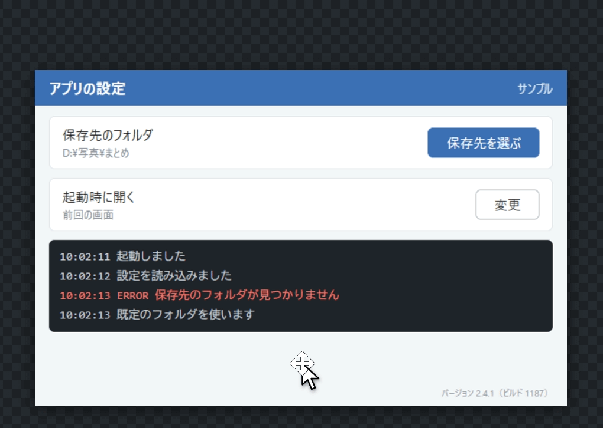

### 吹き出し（U キー）— 指して説明を書き添える

書きたい所をクリックして文字を打ち、**Ctrl+Enter** で確定します。しっぽ付きの枠に入ります。

- しっぽは最初は下（下に場所が無ければ上）に出ます。**しっぽの先の小さな四角をドラッグ**すると、指す所を変えられます
- ドラッグで枠を取って置くと、その幅で折り返します
- 色の欄で縁の色、文字の大きさの欄で全体の大きさが変わります

それぞれの細かい動きは [書き込む](#書き込む) の「道具ごとの詳しい動き」にあります。

### いつもの書き方は「お気に入り」に

下の帯の右寄りにある **「お気に入り」の 1〜4** を押す（またはキー **1〜4**）と、登録した道具・色・太さに一度で持ち替えます。

- 最初に入っているもの：1 青の大きい文字／2 赤の大きい文字／3 赤の四角／4 赤の矢印
- 入れ替えたいときは、道具と書き方を決めてから、ボタンを **Ctrl+クリック**

お気に入りの細かい決まり

- ボタンの絵は、道具の形をその色で描いたものです。カーソルを乗せると中身（例：`青・文字 48px・白フチ（フチ 極太）`）が出ます
- 図形を選んでいるときに押すと、その図形にも同じ書き方が付きます（文字なら色・大きさ・飾り、矢印や四角なら色・太さ）
- Ctrl+クリックで登録するのは、図形を選んでいればその図形の書き方、選んでいなければ持っている道具と今の設定です（選択・つかむ・切り抜きのときは登録できません）
- いまの道具と書き方がお気に入りと同じときは、そのボタンが青く縁取られます

---

## 長いページを1枚にする

画面に入りきらない長いページを、自動でスクロールしながら撮って、縦長の1枚につなぐ手順です。

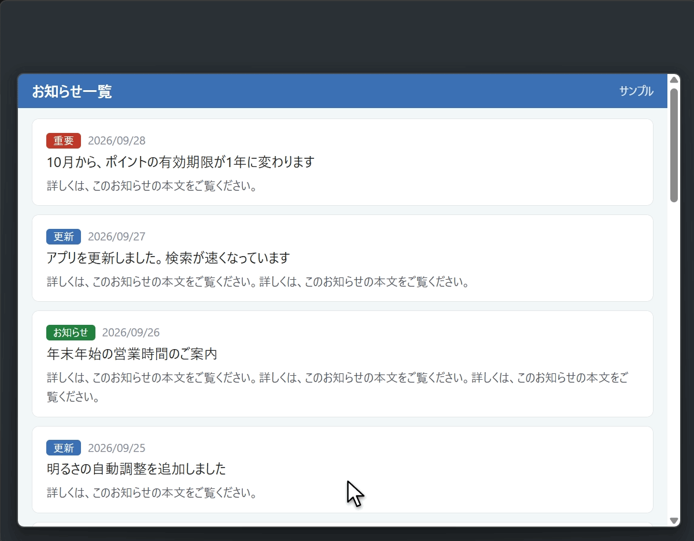

### 1. 始める

トレイのアイコンを**右クリック** → **「スクロールして長いページを撮る」**。

### 2. スクロールする中身を囲む

青い案内が出たら、**スクロールする中身（ページの本文）**をドラッグで囲みます。ブラウザなら、本文のあたりをクリックするだけで窓に吸い付きます。

- 縦は **160px 以上**必要です

### 3. 終わるまで待つ

あとは自動です。少しずつスクロールしては撮り、つなぎ目を見つけて縦につないでいきます。

- **終わるまでマウスに触らない**でください。スクロールは「矢印の下にある窓」に届くので、動かすと別の窓がスクロールします
- 一番下まで来ると自動で止まります（縦 20000px でも止まります）。途中でやめたいときは **Esc**（そこまでの分をつなぎます）

できあがると、編集画面で開きます。

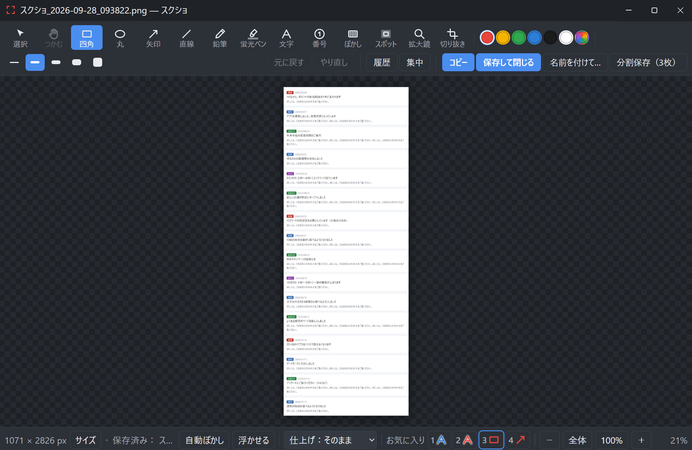

**Google ドキュメントなどに貼るとき**
- 縦に長すぎる画像をそのまま貼ると、文字が潰れて読めなくなります
- 上の図のように **「分割保存（◯枚）」** ボタンが出たら、それを押します。ちょうどよい長さに切り分けて保存されるので、順に貼ります
- 途中に要らない所が長く続くなら、先に[省略（X キー）](#要らない所を抜いて短くする省略x-キー)でその帯を抜くと、1枚のまま短くできます

なぜ分割するのか（Google ドキュメントの上限）

- Google ドキュメント・スライドは、貼った画像の**面積に上限（2,500万ピクセル²）**があり、長辺を基準に縮めるので、縦長すぎる絵は横方向まで潰れます。クリップボードでもファイル挿入でも同じです
- 分割保存は、1枚ずつがふつうの縦横比になるよう切り分け、`ScreenShooter_2026-09-10_014946_1of5.png` のような連番で保存します
- 例：3482 × 20114 px（上限の2.8倍）→ 5枚（1枚 3482 × 4023 px）
- 分割した絵には仕上げ（縁取り・影など）を付けません（順に貼ったとき継ぎ目が目立つため）
- Windows の「フォト」など、ふつうの画像ビューアにはこの制限が無いので、そのままで綺麗に見えます

### 要らない所を抜いて短くする（省略・X キー）

長い表やページの、見せなくてよい途中の行を抜いて、上下をつなぎます。編集画面で使います（長いページに限らず、ふつうに撮った絵でも使えます）。

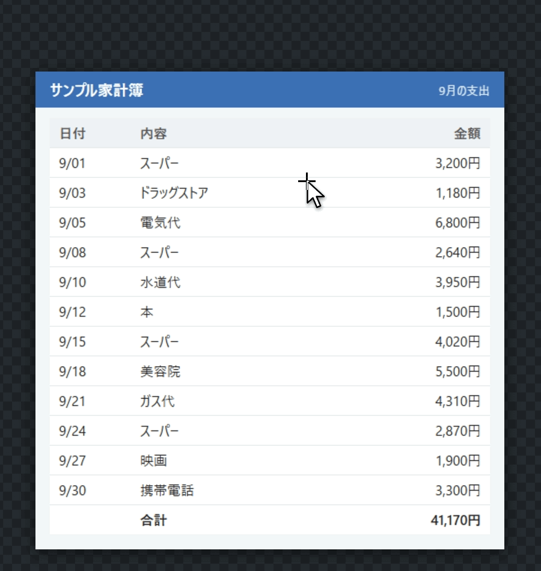

- 抜きたい帯を**上下にドラッグ**します（左右はどこでも同じ）。赤く塗られた所が抜けます
- 何か所でも抜けます。抜いた帯より下の書き込みは、一緒に上へ詰まります
- 保存先の元の絵は削られません。**Ctrl+Z で戻せます**

### うまくいかないとき

| こうなった | こうする |
|---|---|
| 1枚しか撮れない | 囲んだ所がスクロールしなかった。ページの本文の上で囲み直す |
| 途中で止まる | つなぎ目が分からなくなった。動く広告や貼り付いた見出しがあると起きやすい。囲む範囲を狭めると通ることがある |
| 見出しが何度も写る | 画面に貼り付いて動かない部分は、スクロールした回数だけ写る（仕組み上さけられない） |

原因を調べるとき

うまくいかなかったときに出るお知らせのボタンで、原因を確かめられます。

- **詳しい記録を開く** — 1回ごとに何ピクセル動いたか・どこで止まったか（`%APPDATA%\ScreenShooter\scroll-log.txt`）
- **比べた2枚を見る** — 実際に見比べた2枚（`%APPDATA%\ScreenShooter\scroll-debug\`）。2枚目がスクロールした絵になっていなければ、ホイールがそのページに届いていません

Windows の「**非アクティブ ウィンドウをスクロールする**」（設定 → Bluetooth とデバイス → マウス）がオフだと、手前のウィンドウしかスクロールできません。既定はオンです。

---

## 操作の様子を動画で見せる

画面の操作を録画して、MP4（動画）と GIF（動く画像）にする手順です。この手順書の動く画像も、ほとんどこの機能で撮っています。

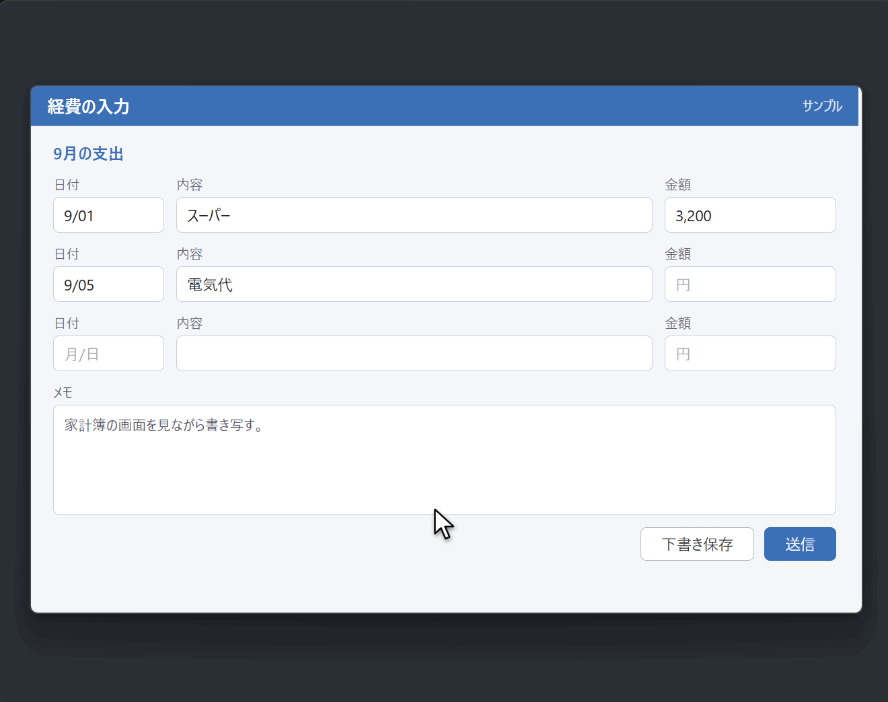

### 1. 始める

トレイのアイコンを**右クリック** → **「録画する（GIF・動画）」**（設定でショートカットキーも割り当てられます）。

### 2. 録りたい範囲を囲む

ドラッグで囲みます（窓への吸い付きも使えます）。**放した瞬間から録画が始まります。**

- 画面の隅に、細い**操作バー**が出て、経過時間が進みます
- 操作バーは録画には写らないので、範囲に重なっても平気です
- パソコンで鳴っている音も一緒に録れます（マイクではなくスピーカーの音。設定で切れます）。長さは 10 分までです

- 操作バーの **「一時停止」** で止めておき、**「再開」** で続きから録れます。止めていた間は動画にも GIF にも入りません（トレイの右クリックからも押せます）
- 設定の「録る前のカウントダウン」を 3 秒・5 秒にすると、画面の真ん中に大きく数えてから録り始めます
- 設定の「録画中も個人情報を自動でぼかす」がオン（既定）なら、録るあいだ 2〜3 秒ごとに文字を読み、見つけた所に**モザイクをかけたまま**録ります。読み取りの合間にスクロールした所は見落とすことがあるので、録ったあと必ず確かめてください

### 3. 「停止」で止める

操作バーの **「停止」**（または **Esc**、録画のキーをもう一度）で止めます。「やめる」を押すと、録ったものを捨てます。

止めた時点で、**MP4 と GIF の両方が保存先フォルダに入っています。** 画面の真ん中に確認画面が出るので、その場で再生して確かめます。

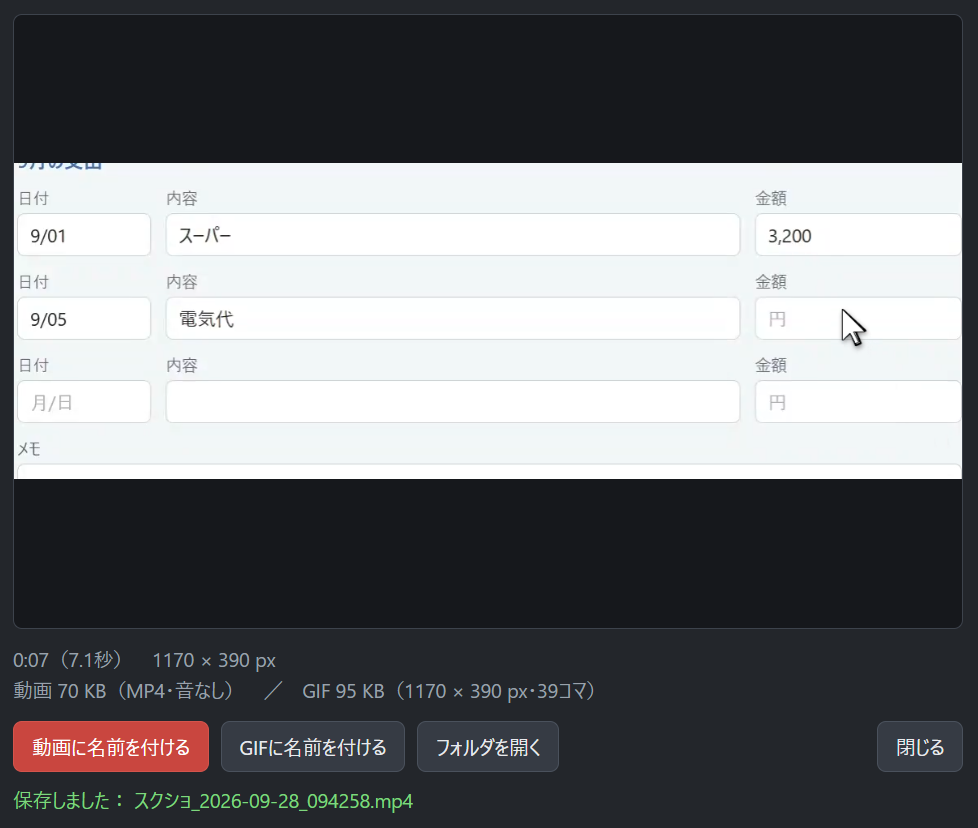

- 別の名前にしたいときだけ「動画に名前を付ける」「GIFに名前を付ける」を押します
- 録ったものは履歴パネルにも並び、ダブルクリックで再生できます

| こうしたい | こうする |
|---|---|
| GIF が重い | 設定で「GIF のなめらかさ」を下げる |
| 色をきれいに残したい | GIF は 256 色までなので、動画（MP4）のほうを使う |

録画の細かい決まり

- 確認画面は出た瞬間に1回だけ手前に出ます。ほかの窓を触って後ろに回っても、タスクバーのアイコンから戻せます
- 動画は MP4（H.264）なので、Windows のプレイヤーや PowerPoint でそのまま開けます
- GIF は動画よりファイルが大きくなることがあります。**横幅は既定で縮めません**（縮めると文字がぼやけるため）
- 写真やグラデーションの多い画面は、256 色に収める都合で**細かい網目**が入ります（色の段差を目立たなくするため。離れて見ると元の色に近く見えます）
- 256 色に減らす都合で、肌の色などは**ほんの少し薄く**なります。色が大事なときは動画で

---

## 手順に番号を付けて説明する

「ここに入れて、次にここ」と順番を見せたいときは、番号マーカーを使います。編集画面で使います。

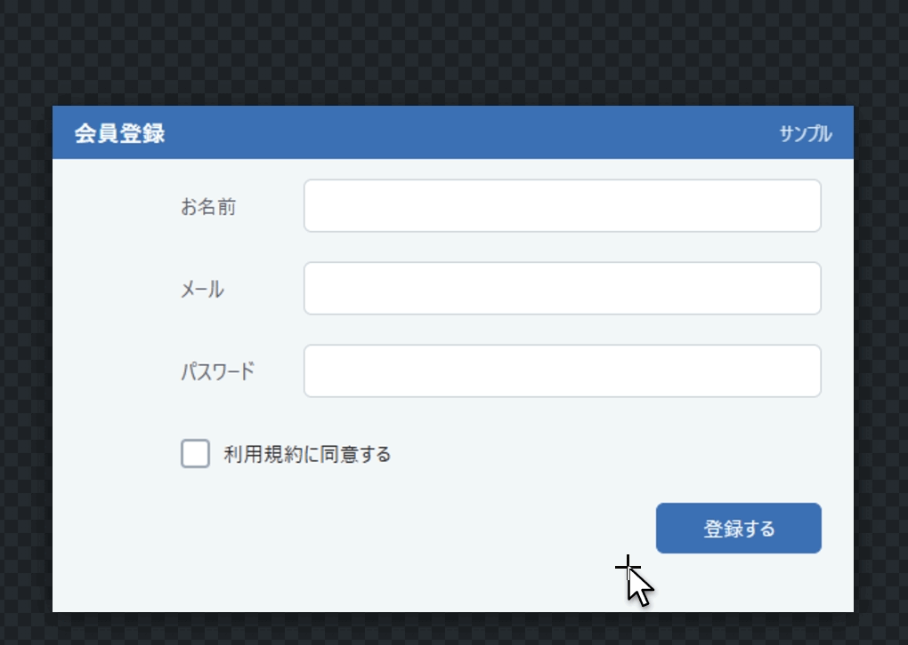

### 1. N キーで持ち替えて、クリックで置く

置いた順に ①②③… と番号が付きます。**大きさは文字の大きさの欄**で決まります（ドラッグして置くと、好きな大きさにできます）。

### 2. Shift を押しながらクリックすると、縦にそろう

少しずれた所をクリックしても、**前の番号の真下（真横）に吸い付いて**、きれいに並びます。

### 3. いらない番号は右クリックで消す

消すと、あとの番号が**自動で詰めて振り直されます**。途中を消しても番号が飛びません。

---

## 資料に貼る前に、大きさと見た目を整える

### 大きさを変える（サイズ）

下の帯の **「サイズ」** を押すと、大きさを決める画面が出ます。**25〜200% のボタン**か、幅・高さの数字で決めます。

- 縦横の比はいつも保たれます。描いた矢印や文字も一緒に縮みます
- 何度変えても撮ったときの絵から作り直すので、**画質は落ち重なりません**。Ctrl+Z か「撮ったときの大きさに戻す」で元どおり

### まわりに余白を足す（説明を書き込む場所を作る）

同じ「サイズ」の画面の下にある **「まわりに余白を足す」** で、上・右・下・左に何 px 足すかと色（白・黒・透明）を決めて **「余白を付ける」** を押します。

- 足した余白にも矢印や文字を置けます。Ctrl+Z か「余白を外す」で元どおり
- 余白は履歴にも残り、大きさを変えると一緒に伸び縮みします

サイズ変更の細かい決まりと画質

- 変えているあいだは、ボタンが青く縁取られて「サイズ 50%」のように倍率が出ます
- 前回 OK した値を覚えていて、次に開いたとき最初から入っています（新しく撮った絵を勝手に縮めはしません）
- 変えた大きさは履歴にも残り、開き直し・履歴からのコピー・浮かせる・並べて1枚に、のどれでもその大きさで出ます。保存先の元の絵はそのまま
- 縮めるときは **Lanczos（ランチョス）** という、文字の輪郭がくっきり残る計算を使います
- 矢印・文字などは変えたあとの大きさで描き直すのでにじみません
- 拡大は 200%・300% のような整数倍ならにじみません。150% のような半端な倍率は少しにじみます
- コピー・保存はすべて PNG（画質が落ちない形式）です
- 元の字が小さい画面を大きく縮めると、字そのものが小さくなって読みにくくなります（どの方法でも避けられません）

### 見栄えよく仕上げる（仕上げ）

下の帯の **「仕上げ：◯◯」** で、コピー・保存するときの見た目を選びます。**「見る」** で、仕上がりを確かめられます（クリックで閉じる）。

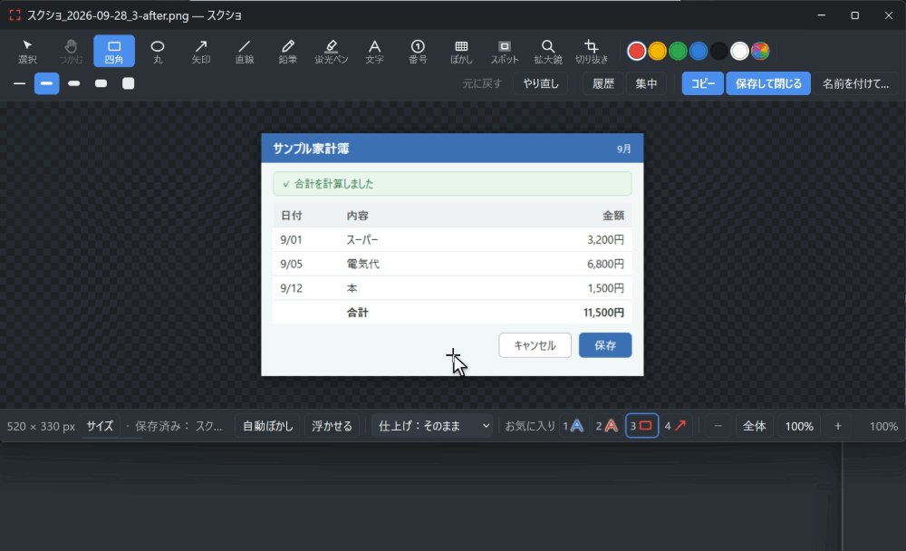

| 仕上げ | どうなるか |
|---|---|
| そのまま | 見えている絵をそのまま出す |
| 黒い縁取り | 絵の外周に細い黒線。白いページに貼っても境目が分かる |
| 角を丸める | 余白を付けずに四隅を丸く切り落とし、細い灰色の縁を付ける（切り落とした角は透明） |
| 影つき | まわりに白い余白、角を丸めて影を落とす |
| 背景つき | 影つきと同じ形で、まわりを青灰色のグラデーションに |

- 付くのはコピー・保存のときだけです。保存先にある元の絵はそのまま残ります
- 最後に選んだ仕上げを覚えていて、次に撮った絵にも付きます（設定の「撮った直後」→「仕上げ」と同じものです）。やめるときは「そのまま」に戻します

仕上げの細かい決まり

- 付くのは Ctrl+C・保存（`_書き込み.png`）・名前を付けて保存・履歴パネルからのコピー。編集画面の絵には付きません
- 仕上げを選んでいると、書き込みが無くても保存で `_書き込み.png` が別に出ます（元の絵と違う絵になるため）
- 余白・丸み・影は絵の大きさに合わせて自動で決まります。影つき・背景つきは透ける所が無いので、貼り先で黒くなりません
- 分割保存と、履歴パネルからのドラッグには付きません（ドラッグで渡るのは保存済みのファイル）

---

## 貼ったときの見え方を確かめる

**F キー**（またはツールバーの **「集中」**）で、窓の枠も道具も消えて**絵だけ**になります。どこかに貼ったらどう見えるかを、まわりに邪魔されずに確かめられます。

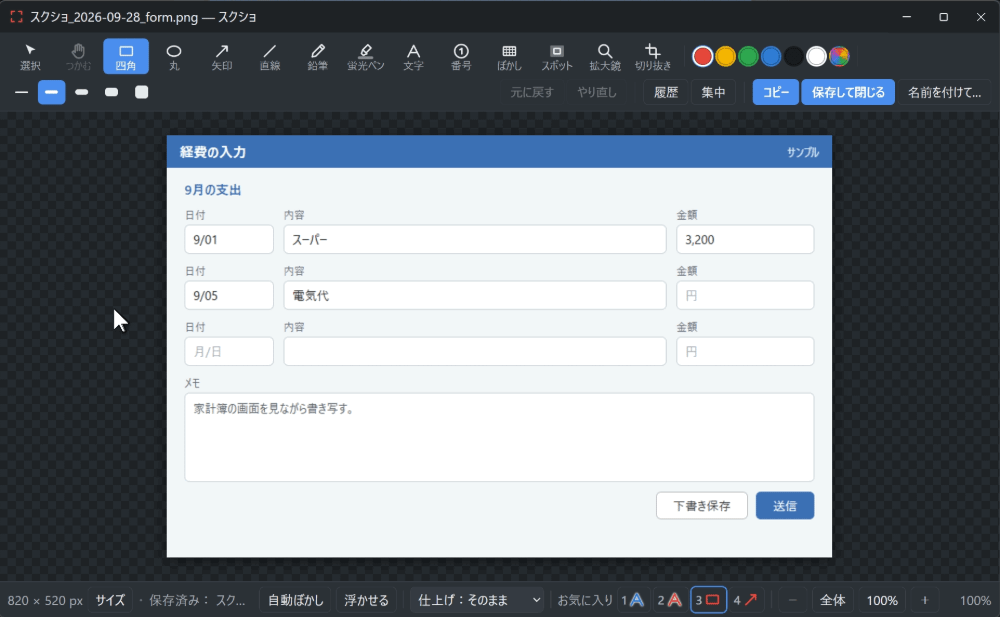

- **カーソルを乗せている間だけ**、道具が絵の上に出ます。外へ出すと消えます
- そのまま書き込みもできます。動かすときは、道具が出ている間にツールバーの空いた所をドラッグします
- 戻すのは **「集中を解除」**・**Esc**・もう一度 **F** のどれでも。ただし切り替えると「元に戻す」の履歴は消えます

集中モードの細かい決まり

- 窓の形は絵の縦横比ちょうどに固定されます。大きさを変えても絵は窓いっぱいのまま。ただし原寸より大きくは引き伸ばさないので、原寸より広げると周りに余白が出ます
- 切り抜くと窓の形もその比に変わります
- 切り替えるときは中身を引き継いで窓を作り直しています（Windows は開いたあとの窓から枠だけを外せないため）。描いたもの・切り抜き・保存先・仕上げは残ります

---

## 画面の文字・色を取り出す

### 文字を読み取ってコピー

トレイの右クリック →「**文字を読み取ってコピー**」（設定でキーも決められます）→ 読みたい所をドラッグで囲みます。

- 読み取った文字が小さな窓に出ます。**直してから**「全部コピー」（Ctrl+Enter）か「選んだ所をコピー」を押します
- 読み取りは Windows の機能で、**このパソコンの中だけ**で行います（自動ぼかしと同じ仕組み）
- 小さすぎる字・薄い字は読み間違えることがあります

### Claude で翻訳する（設定でオンにしたときだけ）

設定の「AI（Claude）」で「読み取った文字を Claude で翻訳するボタンを出す」をオンにすると、読み取った文字の窓に **「Claude で翻訳」** が出ます（日本語へ／英語へ）。

- **押したときだけ、文字（絵ではない）を Anthropic のサーバーへ送ります。** 機密情報が写っている画面では使わないでください。会社のパソコンでは、社内の決まりを確かめてからオンにしてください
- このパソコンの Claude（Claude Code）へのログインが必要です（[README](../README.md#翻訳claudeを使うとき) を参照）。10〜30 秒ほどかかります

### 色を拾ってコピー

トレイの右クリック →「**色を拾ってコピー**」→ 拡大鏡で狙って**クリック**すると、その点の色が `#RRGGBB` の形でクリップボードに入ります。

- **H** キーで 16進 ⇔ RGB（`232, 69, 60`）を切り替えます。矢印キーで1pxずつ動かせます

---

## 画面が直ったら、書き込みはそのままに絵を差し替える

直す前の画面に矢印や説明を書き込んだあと、画面が直ったら、同じ説明のまま絵だけ新しくできます。

1. 編集画面の上の **「撮り直し・差し替え」** を押す
2. 差し替え方を選ぶ

| 選ぶもの | どうなるか |
|---|---|
| 同じ範囲で撮り直す（新しい1枚） | これまでどおり、新しい1枚として撮る（書き込みは引き継がない） |
| 同じ範囲で撮って、下の絵を差し替え | 同じ場所をもう一度撮って、下の絵だけ入れ替える |
| 範囲を選んで撮って、下の絵を差し替え | 範囲を選び直して撮り、下の絵だけ入れ替える |
| クリップボードの絵に差し替え／ファイルの絵に差し替え | 用意してある絵に入れ替える |

- 「同じ範囲」は、範囲を選んで撮った絵のときだけ出ます
- 差し替えても書き込みはそのままです。**前の絵のファイルは保存先に残ります**（元に戻したいときはそれを開く）
- 大きさの違う絵にしたときは、切り抜きと省略は外れます（位置が合わなくなるため）

---

## チームで書き込みを渡し合う

### 書き込み版を渡すと、相手も図形を動かせる

保存（Ctrl+S）でできる `_書き込み.png` には、**元の絵と図形の位置**も入っています。

- ふつうの人には、書き込み入りのただの画像に見えます（メールやチャットにそのまま貼れます）
- ScreenShooter を使っている人が**履歴パネルに落とす**と、元の絵と**動かせる図形**として開けます。矢印をずらす・文字を直すがそのままできます
- 元の絵を中に入れるので、ファイルは約2倍の大きさになります。要らなければ設定の「保存先フォルダ」の下のチェックで切れます

### 名前・タイトル・タグを付けて探す

履歴パネルで右クリック →「**名前を変える…**」（F2）／「**タイトル・タグを付ける…**」。

- 名前を変えると、保存先のファイルの名前も変わります（`_書き込み.png` も一緒に）
- タイトルを付けると、一覧の時刻の代わりにタイトルが出ます
- 上の **絞り込み** 欄（Ctrl+F）に打つと、ファイル名・タイトル・タグ・撮った日（`2026-10-03` や `10/3`）で探せます。空白で区切ると、全部を含むものだけ
- 右クリックの「ファイルの場所（パス）をコピー」で、保存先の場所を文字でコピーできます

---

## 時間差で撮る

トレイのアイコンを右クリック →「**時間差で撮る**」→ 設定の秒数 / 3秒後 / 5秒後 / 10秒後。設定でキーを決めておけば、キー1つでも始められます。

マウスを乗せたときだけ出るメニューやツールチップは、撮影キーを押すと消えてしまいます。先にこれを押しておき、待っている間にメニューを開いておきます。

- 残り秒数は**画面の真ん中に大きく**出ます。この表示はクリックもキーも邪魔しないので、開いておいたメニューは閉じません（0 になる直前に消えて、写り込みません）
- やめるときは、トレイの右クリック →「時間差撮影をやめる」か、時間差のキーをもう一度押します
- 秒数（1〜60秒）は設定の「撮り方」→「時間差の秒数」で決めます

---

## ほかの画像を開く

手元の JPEG や PNG も、このアプリで開いて書き込めます。

- **履歴パネルに画像をドラッグして落とす**（すぐ使えます）
- **右クリック →「その他のオプションを表示」→「送る」→「ScreenShooterで開く」**（設定の「ほかの画像を開く」を先にオンにしておく）

どちらも**保存先フォルダにコピーしてから**開き、履歴にも並びます。**元のファイルはそのまま**です。

ほかの画像を開くときの細かい決まり

- 同じ絵を2回渡しても増えません（前に取り込んだものを開き直します）。保存先フォルダの中にある絵は、コピーせずそのまま開きます
- 何枚かまとめて渡したときは、履歴に入れるだけで編集画面は開きません
- 扱えるのは .png / .jpg / .jpeg / .gif / .bmp / .webp。JPEG に書き込んでも、書き出されるのは PNG（`_書き込み.png`）
- Windows の「プログラムから開く」には出ません（レジストリへの登録が要るため。代わりにショートカット1個で済む「送る」を使っています）

---

## 設定

トレイのアイコンを右クリック →「**設定…**」。

| 項目 | 中身 |
|---|---|
| ショートカットキー | 範囲・同じ範囲でもう一度・画面全体・スクロール・録画・時間差・文字の読み取り・色の8つ。欄をクリックしてからキーを押す。決めたキーはトレイのメニューにも出る |
| 保存先フォルダ | 撮った絵が入る場所・書き込み版に図形を動かせる情報も入れるか |
| 撮った直後 | 編集画面を開くか、開かずに履歴パネルに並べるか・クリップボードに入れるもの・仕上げ |
| 撮り方 | 窓に枠を吸い付かせるか・マウスカーソルも写すか・時間差の秒数 |
| 自動ぼかし | 撮影後に自動でぼかすか・ぼかしの強さ（弱・標準・強）・自動でぼかす言葉・見出しとして探す言葉 |
| 録画 | 動画と GIF のなめらかさ・パソコンの音も録るか・録画中も自動でぼかすか・録る前のカウントダウン・GIF の横幅の上限 |
| 履歴パネル | サムネイルの大きさ・何枚まで残すか・並び順 |
| ほかの画像を開く | 右クリックの「送る」に「ScreenShooterで開く」を出すか |
| AI（Claude） | 読み取った文字を Claude で翻訳するボタンを出すか（既定はオフ） |
| 起動 | Windows の起動時に自動で起動するか（スタートアップ フォルダに `ScreenShooter.lnk` を置く・消す） |

- 修飾キー無しで使えるのはファンクションキーと PrintScreen だけです。他のアプリが同じキーを使っていると、その場で赤い注意書きが出ます
- 自動起動のチェックは、切り替えて「保存する」を押したときだけ反映されます。外したときに消すのは、このアプリを起動するショートカットだけです
